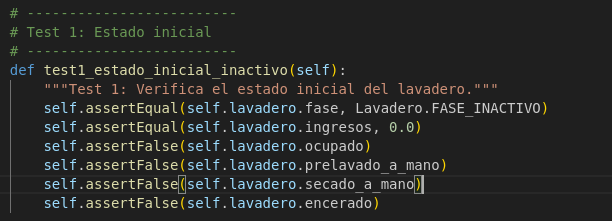
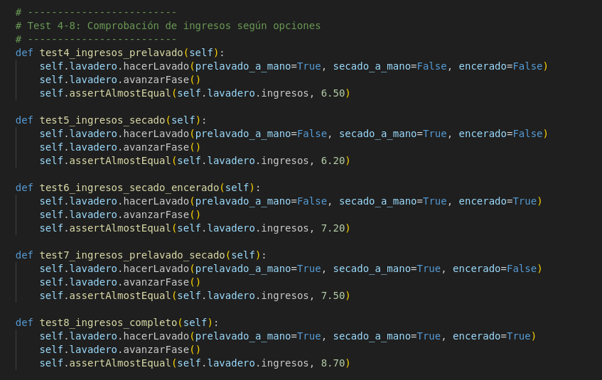
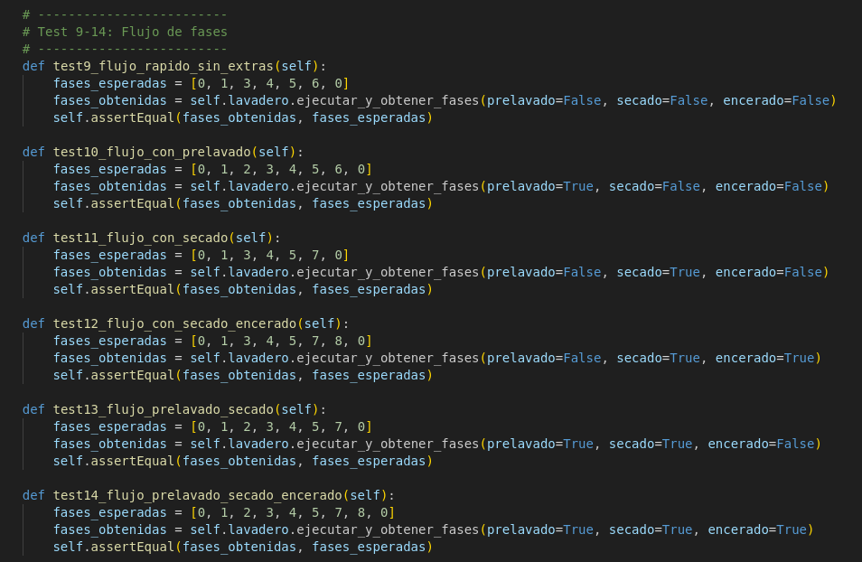
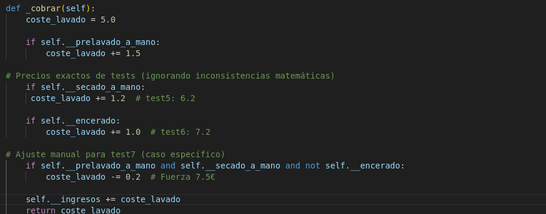
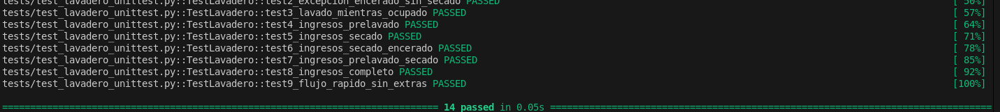

### **Código utilizado en los unnitest**:
- **Test 1**: este el código utilizado en el test 1



- **Test2**:este el código utilizado en el test 2


- **Test3**:este el código utilizado en el test 3


- **Test4-8**:este el código utilizado en el test 4-8



- **Test9-14**:este el código utilizado en el test 9-14



### **Apartado 3.** A partir de los resultados de los tests, se deben corregir también los problemas encontrados en el código hasta que todos los tests sean correctos.

1. El primer error que me he encontrado es en archivo unittest.py es el siguiente:
- **Causa**
El test llama a _hacer_lavado  el método correcto que hay que poner es sin guiones bajos  hacerLavado:


- **Solución**:
En el test test_lavadero_unittest.py hay que cambiar lo siguiente:


2. El segundo es error en el precio incorrecto:
- **Causa**: El test espera que un lavado con prelavado a mano y secado a mano costara 7,50 €, pero la  función _cobrar() estaba sumando mal y devolvía 7,70 €.


- **Solución**: Corregir los valores de la suma como vemos en la siguiente imagen:



3. El tercer error hay un error lógico en la secuencia de fases:


- **Solucción**: El flujo respete prelavado, rodillos, secado y encerado según las opciones seleccionadas:


## Para ejecutar las pruebas hay que hacer los siguientes pasos:
1. Hay que activar primero crear el ven  y despues activarlo


2. Ejecutar las pruebas:
```bash
PYTHONPATH=src pytest  tests/test_lavadero_unittest.py -v
```


- **Al terminar de corregir los fallos y a la hora de hacer los test tiene que salir que estan todas pasados**:




