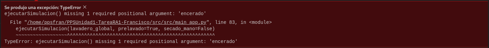
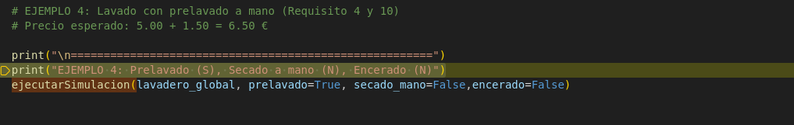

# 1. Documentación y prueba del programa
## Apartado 1:
- En el siguiente enlace te llevará a la documentación de Jupyter noteboock:
[Documetación del programa en jupyter noteboock](Jupyter%20NotebookApartado1.md)

## Apartado 2:

* Como vemos en la imagen a la hora de ejecutar el programa nos da un error :

1. El error encontrado es el siguiente:

- indica que la función ejecutarSimulacion() requiere tres argumentos para solucionarlos es llamar a encerrado:

