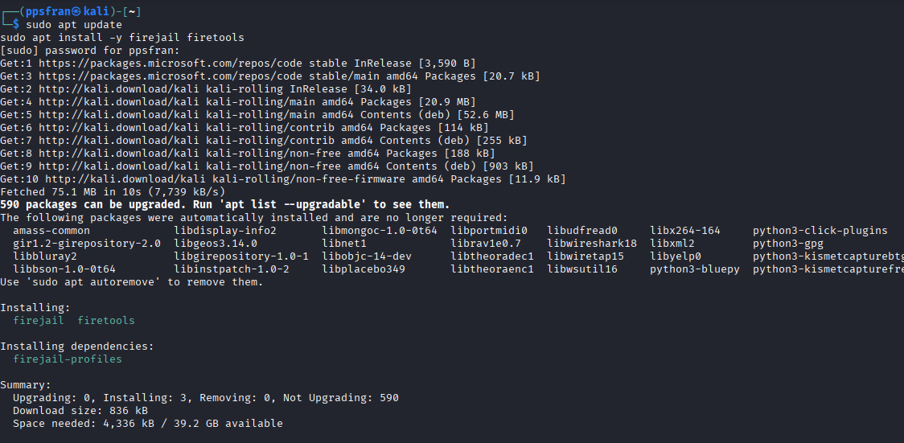
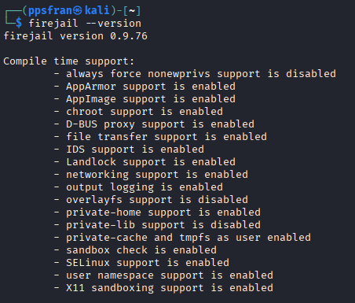
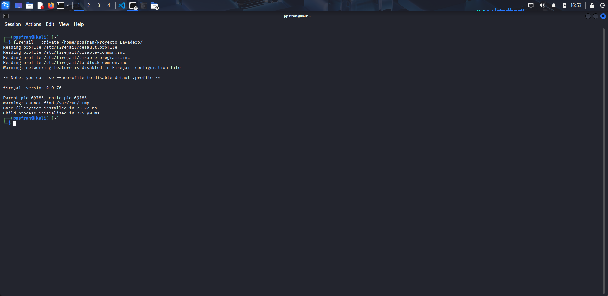
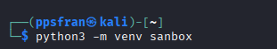
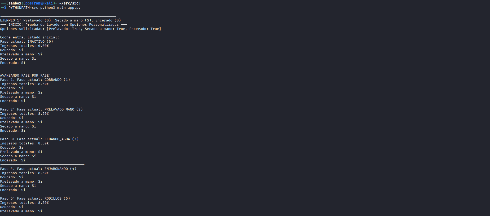

### 1. Instalar Firejail y Firetools
```bash 
# En Debian/Ubuntu
sudo apt update
sudo apt install -y firejail firetools
```
- **Captura de instalación**:


- **Para saber que versión tiene** :
```bash
# Verificar instalación
firejail --version
```


### 2. Primero preparar el firejail:
- Si quieres que tu aplicación acceda solo en una carpeta especifica:
```bash
firejail --private=/home/ppsfran/Proyecto-Lavadero/

```




### 3.Segundo prepara el entorno para poder ejecutar las pruebas:
1. Creamos entorno virtual de Python

```bash
python3 -m venv sanbox
```



2. Activamos el entorno virtual:

```bash
source sanbox/bin/activate
```


3. Ejecutar el programa dentro de sanbox dentro de la carpeta aislada:

```bash
PYTHONPATH=src python3 main_app
```

